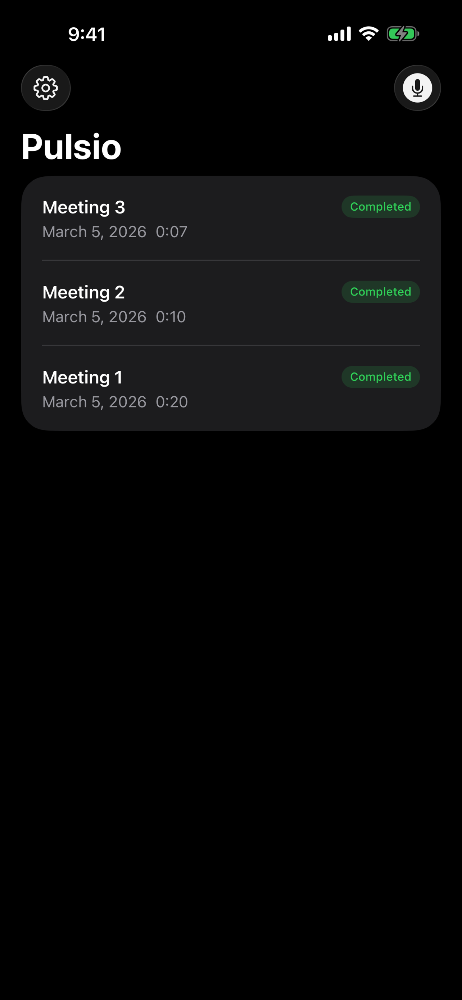
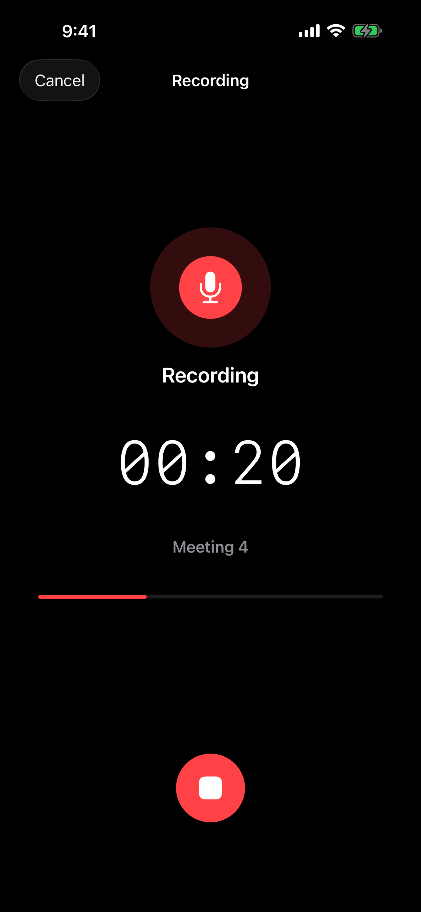
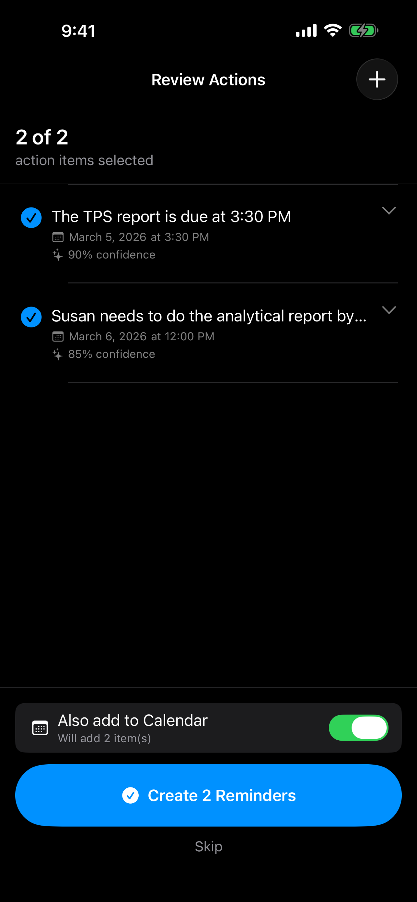
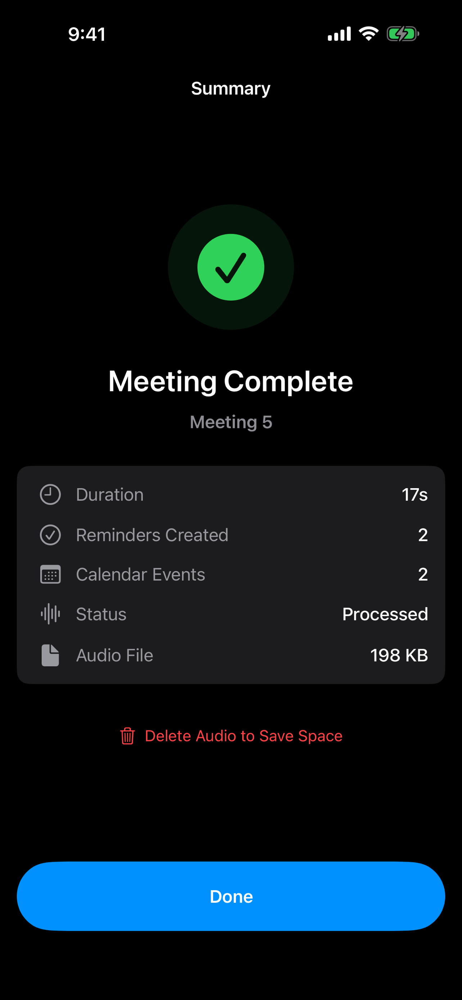

# Pulsio

**Turn Meetings Into Actions**

Pulsio is a privacy first iOS app that records meetings, transcribes speech, and extracts action items using entirely on device intelligence. No cloud. No accounts. No subscriptions. Your meetings stay on your phone.

Record a conversation, and Pulsio will identify what needs to get done, then let you send those tasks straight to Apple Reminders and Calendar with a single tap.

  
  
  
  

## How It Works

1. **Record** your meeting with a single tap. Background recording is fully supported, so you can switch apps without interrupting the session.
2. **Pulsio transcribes** the audio on device using Apple's Speech framework. Nothing leaves your phone.
3. **Action items are detected** automatically using Apple's NaturalLanguage framework. Tasks, deadlines, and assignments are pulled from natural conversation.
4. **Review and edit** the detected actions. Include or exclude items, tweak wording, and confirm what matters.
5. **Send to Reminders and Calendar.** Selected actions become real Apple Reminders with due dates and alerts. Items with deadlines can also create Calendar events.

## Features

**On Device Processing**
All transcription and action detection runs locally using Apple's built in frameworks. Audio never leaves the device, and no network connection is required for core functionality.

**Smart Action Detection**
Pulsio identifies tasks from natural speech patterns: commitments ("I'll send the report"), assignments ("Sarah should update the deck"), deadlines ("by Friday"), and more. A compound sentence splitter handles the run on text that speech recognition often produces.

**Apple Reminders and Calendar Integration**
Detected actions flow directly into Apple's native Reminders and Calendar apps through EventKit. Due dates, alarms, and notes are included automatically.

**Live Activity**
A Live Activity appears on the Lock Screen and Dynamic Island while recording, showing elapsed time and recording status at a glance.

**Background Recording**
Switch to other apps freely during a meeting. Pulsio continues recording in the background without interruption.

**Pro Upgrade**
Free recordings are limited to 3 minutes. A one time $5.99 purchase unlocks unlimited recording length (up to 60 minutes per session) with no subscriptions.

## Architecture

Pulsio is built entirely with Apple native frameworks:

| Layer | Technology |
|---|---|
| UI | SwiftUI |
| Audio | AVFoundation |
| Transcription | Speech (on device) |
| NLP | NaturalLanguage |
| Persistence | Core Data |
| Reminders/Calendar | EventKit |
| Live Activity | ActivityKit + WidgetKit |
| Monetization | StoreKit 2 |

No third party SDKs. No analytics. No tracking.

## Privacy

Pulsio was designed around a simple principle: your data belongs to you.

There are no accounts to create, no servers to upload to, and no third party code running in the background. The app's [Privacy Policy](https://jpcostan.github.io/pulse/privacy-policy) reflects this: **Pulsio does not collect data.**

## Requirements

- iOS 17.0+
- iPhone (iPad compatible)
- Xcode 26+ (for building from source)

## License

Copyright 2026 Sleepwalker Software LLC. All rights reserved.
